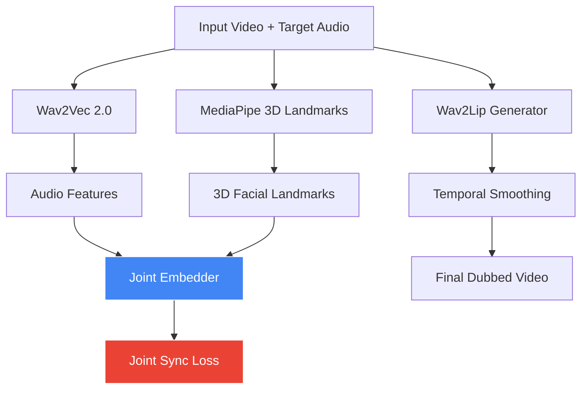

# Linguisync-3D: Neural Lip & Facial Dubbing

**Cross-Modal 3D-Aware Neural Facial Dubbing using Joint Audio-Visual Embedding**


---

## 🎯 Project Overview

**Linguisync-3D** is a deep learning system designed for high-quality **neural facial dubbing** across languages. It overcomes the limitations of traditional 2D lip-sync methods by incorporating **3D facial geometry** and a novel **Joint Audio-Visual Embedding Loss**.

The system can take any video and new audio (English, Hindi, etc.) and generate natural-looking lip movements while preserving the person's identity.

---

### Prerequisites

```bash
pip install torch torchvision torchaudio
pip install transformers
pip install mediapipe
pip install opencv-python
```

## ✨ Key Features

- 3D Facial Landmark Extraction (MediaPipe)
- Rich Phoneme-level Audio Features (Wav2Vec 2.0)
- **Core Novelty**: Joint Audio-Visual Embedding Loss
- Wav2Lip as base generator
- Temporal smoothing for flicker-free output
- Fully offline & reproducible

  
## Core Novelty - Joint Audio-Visual Embedding Loss

The main innovation of **Linguisync-3D** is the **Joint Audio-Visual Embedding Loss**, which aligns audio features with 3D facial geometry frame-by-frame.

$$
\mathcal{L}_{sync} = \sum_{t=1}^{T} \left\| \text{Enc}_{\text{audio}}(a_t) - \text{Enc}_{\text{video}}(v_t) \right\|^2
$$

**Where:**
- $\text{Enc}_{\text{audio}}(a_t)$ = Audio embedding from Wav2Vec 2.0 at time $t$
- $\text{Enc}_{\text{video}}(v_t)$ = 3D facial landmarks embedding from MediaPipe at time $t$
- $T$ = Total number of frames

This loss enforces **cross-modal temporal consistency** — ensuring that the sound at any moment corresponds to the correct mouth and facial configuration.

---

## 📌 System Architecture



## 🔍 Component Overview

| Component | Description |
|-----------|-------------|
| **Wav2Vec 2.0** | Extracts deep audio features from the target audio |
| **MediaPipe 3D Landmarks** | Detects and tracks 3D facial landmarks from input video |
| **Joint Embedder** | Fuses audio and visual features into a shared embedding space |
| **Joint Sync Loss** | Computes audio-visual synchronization loss during training |
| **Wav2Lip Generator** | Generates lip-synced frames based on target audio |
| **Temporal Smoothing** | Reduces flickering and ensures frame-to-frame consistency |


🛠️ Tech Stack
Component,Technology Used
Audio Feature Extraction,Wav2Vec 2.0
3D Facial Landmarks,MediaPipe Face Mesh
Lip Sync Generation,Wav2Lip (GAN)
Joint Embedding,Custom PyTorch NN
Framework,PyTorch + OpenCV
Environment,Google Colab

📁 Project Structure
Linguisync-3D/
├── data/                          # GRID Dataset videos
├── results/                       # Dubbed videos + models
│   ├── hindi_high_energy_final.mp4
│   ├── long_paragraph_dubbed.mp4
│   └── improved_joint_embedder.pth
├── notebooks/                     # Main Colab Notebooks
└── README.md

🚀 How It Works

Input — Source video + New target audio
Audio Processing — Extract features using Wav2Vec 2.0
3D Geometry — Extract 478 3D landmarks using MediaPipe
Cross-Modal Alignment — Train using Joint Sync Loss (Core Novelty)
Lip Generation — Wav2Lip generates new mouth movements
Smoothing — Apply temporal smoothing
Output — Natural dubbed video

📊 Results & Achievements
Successfully dubbed English and Hindi speeches
Joint Sync Loss achieved: 0.0152 (after training)
Working with long paragraphs and energetic motivational speech
3D-aware dubbing pipeline completed
Fully offline implementation

👨‍💻 Author
Kavya Thakar
Department of Information and Communication Technology
Marwadi University, Rajkot
